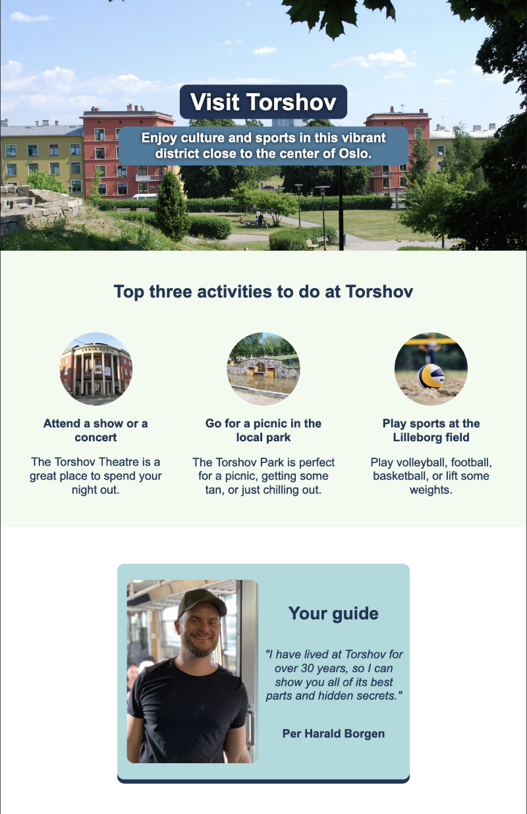

# Scrimba Frontend Career Path: Hometown Homepage 2024

This project is a representation of Torshov, showcasing its cultural and sports activities.

## Introduction

This project is part of the Solo Project from Scrimba's Frontend Career Path, specifically from the 'Web Dev Basics' module, covering basic HTML and CSS. The design was provided in a [Figma file](https://www.figma.com/design/2QuGfAOcHaZJ6aHXfuamnK/Hometown-Homepage?node-id=121-2&t=rn0SeOJebjvex4CG-0).

## Screenshot

## Live Site

[Hometown Homepage](https://scrimba-hometown-homepage-2024.netlify.app/)

## Requirements

-   Built from scratch.
-   Uses classes, Flexbox, background images, and the specified color palette.

## Features

-   **Hero Section:**
    -   Header with main title and subtitle using `CC` for transparency and text-shadow for better readability.
-   **Activities Section:**
    -   Displays top three activities with descriptive alt texts for better accessibility.
-   **Guide Section:**
    -   Profile of the guide with a brief introduction.

## Customizations

-   Added `CC` to colors for opacity.
-   Used text-shadow on headers to make them pop.

## Technologies Used

-   HTML5
-   CSS3
-   Flexbox

## Links

-   [Frontend Career Path](https://v2.scrimba.com/the-frontend-developer-career-path-c0j)
